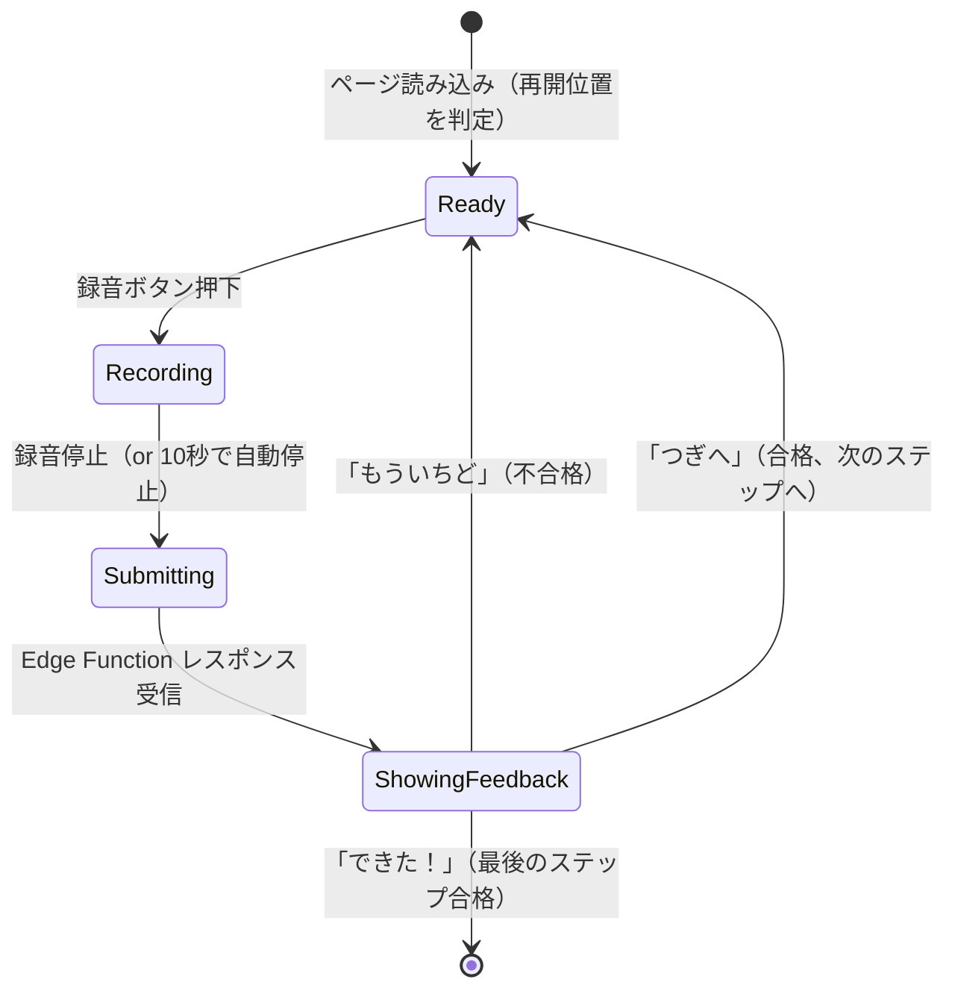

# Practice - Page Spec

## 1. Overview

発音練習のコアフロー。モジュール一覧から単語を選び、発音してフィードバックを受ける。

**Related Documents**:
- [Practice Database Spec](../database.md)
- [Practice Edge Function Spec](../edge-functions.md)
- [App Spec](../../app.md)

## 2. User Stories

As a learner,
- モジュールを選んで練習を始めたい
- 各単語の合格状態を確認して、未完了の単語に取り組みたい
- 発音した直後に、どの音が正しくてどの音が間違っているか知りたい
- 合格したら次の単語/例文に進みたい

## 3. Pages

| ページ | パス | 説明 |
|--------|------|------|
| モジュール一覧 | /modules | モジュールのリストと進捗 |
| モジュール詳細 | /modules/:moduleId | 10 単語の一覧と合格状態 |
| 練習 | /modules/:moduleId/words/:wordId | 単語/例文の発音練習 |

## 4. Module List

### Route

- **Path**: `/modules`
- **Auth**: 必要
- **Learner**: 必要

### Data

| Name | Source | Filter |
|------|--------|--------|
| modules | modules テーブル | - |
| moduleProgress | v_module_progress ビュー | learner_id = selectedLearnerId |

### Components

```
ModuleListPage
├── PageHeader（「モジュール一覧」）
└── ModuleList
    └── ModuleCard（繰り返し）
        ├── ModuleTitle
        ├── ProgressBar（mastered_words / total_words）
        └── CompletedBadge（is_completed 時のみ）
```

### Interactions

- ModuleCard → /modules/:moduleId へ遷移

### Edge Cases

| ケース | 動作 |
|--------|------|
| モジュールが 0 件 | 「モジュールを準備中です」 |

## 5. Module Detail

### Route

- **Path**: `/modules/:moduleId`
- **Auth**: 必要
- **Learner**: 必要

### Data

| Name | Source | Filter |
|------|--------|--------|
| module | modules テーブル | id = moduleId |
| words | words テーブル | module_id = moduleId |
| wordMastery | v_word_mastery ビュー | learner_id = selectedLearnerId, module_id = moduleId |

### Components

```
ModuleDetailPage
├── PageHeader（モジュール名 + 戻るボタン）
├── ModuleProgress（合格単語数 / 10）
└── WordList
    └── WordCard（繰り返し）
        ├── WordImage
        ├── WordText（英単語 + 日本語）
        └── MasteryStatus
```

### Business Logic

**MasteryStatus の判定**:

| 表示 | 条件 |
|------|------|
| 未挑戦 | v_word_mastery にレコードなし |
| 練習中 | レコードあり、is_mastered = false |
| 合格 | is_mastered = true |

### Interactions

- WordCard → /modules/:moduleId/words/:wordId へ遷移
- 戻るボタン → /modules へ遷移

### Edge Cases

| ケース | 動作 |
|--------|------|
| moduleId が存在しない | /modules へリダイレクト |

## 6. Practice

### Route

- **Path**: `/modules/:moduleId/words/:wordId`
- **Auth**: 必要
- **Learner**: 必要

### Data

| Name | Source | Filter |
|------|--------|--------|
| word | words テーブル | id = wordId |
| sentences | sentences テーブル | word_id = wordId, ORDER BY display_order |
| pastAttempts | attempts テーブル | learner_id = selectedLearnerId, word_id = wordId, is_passed = true |

### Components

```
PracticePage
├── PracticeHeader
│   ├── BackButton
│   ├── StepIndicator（「単語 → 例文1 → 例文2」の現在位置）
│   └── WordInfo（英単語 + 日本語 + 絵）
├── PracticeContent
│   ├── TargetText（現在の練習対象テキスト）
│   ├── AudioPlayButton（ネイティブ音声再生）
│   └── RecordButton（録音開始/停止）
├── LoadingOverlay（Edge Function 応答待ち）
└── FeedbackPanel（結果受信後に表示）
    ├── ScoreDisplay（全体スコア）
    ├── PhonemeGrid（音素ごとの色分け、word でグループ化）
    ├── MistakeHints（間違えた音素の指摘リスト）
    └── ActionButton（「もういちど」 or 「つぎへ」）
```

### Business Logic

**練習ステップの進行**:

練習は「単語 → 例文1 → 例文2 → ...」の順で進む。各ステップで合格すると次へ進む。

| ステップ | 対象 | Edge Function の sentence_id |
|---------|------|------------------------------|
| word | 単語そのもの | null |
| 0 | sentences[0] | sentences[0].id |
| 1 | sentences[1] | sentences[1].id |
| ... | ... | ... |

**練習の再開位置**:

ページを開いた時、pastAttempts から完了済みステップを判定し、最初の未完了ステップから開始する。pastAttempts は `target_type` と `sentence_id` で各ステップの合格有無を判定する。

- `target_type = 'word'` の合格 attempt がない → word ステップから
- word は合格済み、`sentence_id = sentences[0].id` の合格 attempt がない → ステップ 0 から
- すべて合格済み → word ステップから（やり直し可能）

**録音**:

- MediaRecorder API で WebM 形式で録音
- 最大録音時間: 10 秒（自動停止）
- 録音中は RecordButton が停止ボタンに変わる

**音声再生**:

- 単語練習時: `word.audio_url` を再生
- 例文練習時: `sentences[n].audio_url` を再生

**Edge Function 呼び出し**:

- 録音停止後、LoadingOverlay を表示して score-pronunciation を呼び出す
- レスポンスを受け取ったら FeedbackPanel を表示

**PhonemeGrid の表示**:

phonemes 配列を `word` フィールドでグループ化し、単語ごとに音素を横に並べる。各音素の色：
- quality_score >= 80 → 緑
- quality_score >= 60 → 黄
- quality_score < 60 → 赤

**MistakeHints の生成**:

phonemes 配列から `is_correct = false` の音素を抽出し、最大 3 件を表示。音素→文字表記マッピング（[App Spec](../../app.md#8-phoneme-display-mapping) 参照）で変換する。

フォーマット: 「"r" が "l" に聞こえたよ」

**合格判定後のアクション**:

| 条件 | ActionButton |
|------|-------------|
| 不合格 | 「もういちど」→ FeedbackPanel を閉じ、同じステップでやり直し |
| 合格、次のステップあり | 「つぎへ」→ 次のステップに進む |
| 合格、最後のステップ | 「できた！」→ /modules/:moduleId へ遷移 |

### State Transitions



### Edge Cases

| ケース | 動作 |
|--------|------|
| wordId が存在しない | /modules/:moduleId へリダイレクト |
| 例文が 0 件 | 単語練習のみで合格判定 |
| マイク権限が拒否された | 「マイクのしようをきょかしてね」メッセージ + 設定方法のガイド |
| 録音中にページ離脱 | MediaRecorder を停止、録音データを破棄 |
| Edge Function タイムアウト | 「うまくいかなかったよ。もういちどためしてね」、Ready 状態に戻る |
| Edge Function エラー | 同上 |
